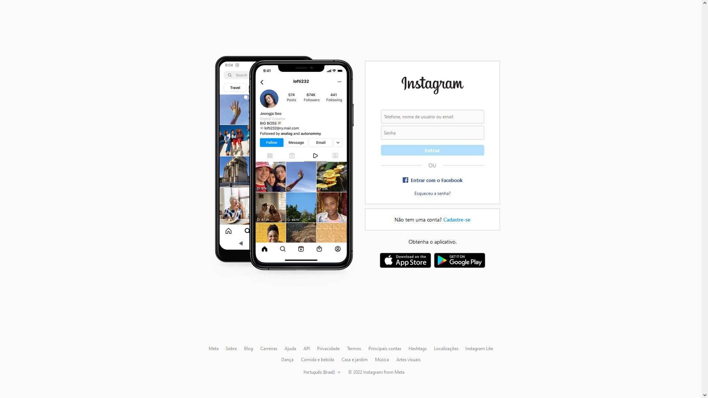
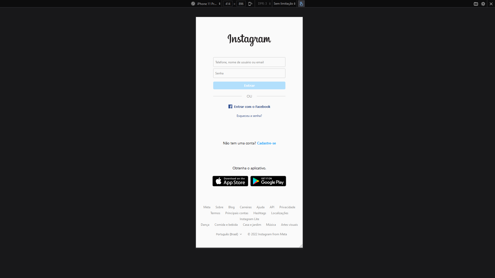

# Tela de login do Instagram 

O objetivo desse desafio é criar uma cópia da tela de login utilizada pelo [Instagram](https://www.instagram.com/). Que deve por os conhecimento adquiridos nos cursos de HTML e CSS Flexbox a prova

## Objetivos
- Aprimorar os conhecimentos adquiridos sobre **HTML5**
- Exercitar o que foi aprendido sobre design Responsivo, utlizando **Flexbox**

### Projeto finalizado (temporariamente)
> Ainda há varios pontos de melhorias a serem feitas lo layout do projeto. 
> Devido a complexidade um pouco elevada, este projeto fica marcado para reformulação. 
> Não foi possível implementar algumas das funcionalidades visuais por não utilizar JavaScript.

### Observações
- A versão da tela de login utilizada neste projeto é referente a vigente na data **30/04/2022**.
- Nenhuma parte do código utilizado foi **copiado** da página do produto ariginal.
- Apenas para fim didático. Não oferece funcionalizades além da estética.

### Tecnologias utilizadas
- HTML5
- CSS3
- Design Responsivo Flexbox

### Versão da tela em modo Desktop

### Versão da tela em modo Responsivo

